# R&D Tax Incentive (R&DTI) Visual Assessment Guide

## 🎯 Quick Navigation
- [Eligibility Decision Tree](#eligibility-decision-tree)
- [Core vs Supporting Activities Classification](#core-vs-supporting-activities-classification)
- [Documentation Requirements Flow](#documentation-requirements-flow)
- [Technical Uncertainty Framework](#technical-uncertainty-framework)
- [Systematic Progression Process](#systematic-progression-process)
- [Industry Knowledge Evaluation](#industry-knowledge-evaluation)
- [Compliance Timeline](#compliance-timeline)
- [Quick Reference Tables](#quick-reference-tables)

---

## Overview

The Australian R&D Tax Incentive provides significant tax offsets for eligible research and development activities. This guide provides visual decision-making tools to assess eligibility and ensure compliance with AusIndustry and ATO requirements.

### 💰 Tax Offset Rates
| Company Turnover | Tax Offset | Type | Formula |
|-----------------|------------|------|---------|
| < $20M | **43.5%** | Refundable | Corporate tax rate (25%) + 18.5% premium |
| ≥ $20M (0-2% R&D intensity) | **38.5%** | Non-refundable | Corporate tax rate (30%) + 8.5% premium |
| ≥ $20M (>2% R&D intensity) | **38.5%** | Non-refundable | Corporate tax rate (30%) + 16.5% premium |

### 📊 Key Thresholds
- **Minimum expenditure**: $20,000
- **Maximum expenditure**: $150 million per year
- **Registration deadline**: 10 months after income year end
- **New exclusions (July 1, 2025)**: Gambling and tobacco industries

---

## Eligibility Decision Tree

This comprehensive flowchart guides you through the complete eligibility assessment process:

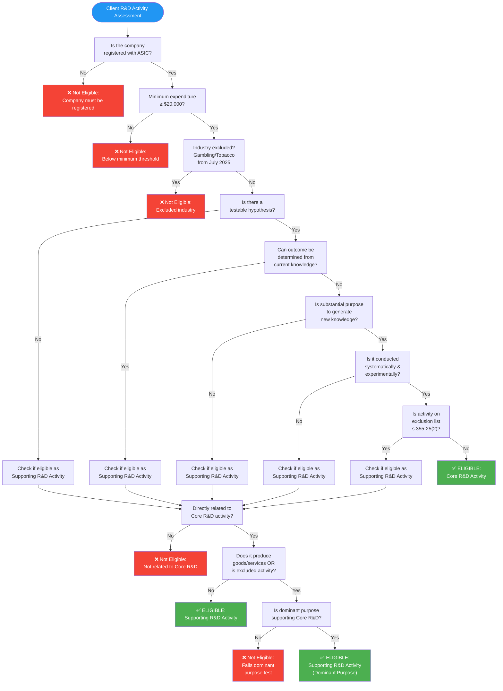
```mermaid
flowchart TD
    Start([Client R&D Activity Assessment]) --> Q1["Is the company<br/>registered with ASIC?"]
    
    Q1 -->|No| NotElig1["❌ Not Eligible:<br/>Company must be registered"]
    Q1 -->|Yes| Q2["Minimum expenditure<br/>≥ $20,000?"]
    
    Q2 -->|No| NotElig2["❌ Not Eligible:<br/>Below minimum threshold"]
    Q2 -->|Yes| Q3["Industry excluded?<br/>Gambling/Tobacco<br/>from July 2025"]
    
    Q3 -->|Yes| NotElig3["❌ Not Eligible:<br/>Excluded industry"]
    Q3 -->|No| Q4["Is there a<br/>testable hypothesis?"]
    
    Q4 -->|No| CheckSupp1["Check if eligible as<br/>Supporting R&D Activity"]
    Q4 -->|Yes| Q5["Can outcome be<br/>determined from<br/>current knowledge?"]
    
    Q5 -->|Yes| CheckSupp2["Check if eligible as<br/>Supporting R&D Activity"]
    Q5 -->|No| Q6["Is substantial purpose<br/>to generate<br/>new knowledge?"]
    
    Q6 -->|No| CheckSupp3["Check if eligible as<br/>Supporting R&D Activity"]
    Q6 -->|Yes| Q7["Is it conducted<br/>systematically &<br/>experimentally?"]
    
    Q7 -->|No| CheckSupp4["Check if eligible as<br/>Supporting R&D Activity"]
    Q7 -->|Yes| Q8["Is activity on<br/>exclusion list<br/>s.355-25(2)?"]
    
    Q8 -->|Yes| CheckSupp5["Check if eligible as<br/>Supporting R&D Activity"]
    Q8 -->|No| CoreElig["✅ ELIGIBLE:<br/>Core R&D Activity"]
    
    CheckSupp1 --> SuppQ1["Directly related to<br/>Core R&D activity?"]
    CheckSupp2 --> SuppQ1
    CheckSupp3 --> SuppQ1
    CheckSupp4 --> SuppQ1
    CheckSupp5 --> SuppQ1
    
    SuppQ1 -->|No| NotElig4["❌ Not Eligible:<br/>Not related to Core R&D"]
    SuppQ1 -->|Yes| SuppQ2["Does it produce<br/>goods/services OR<br/>is excluded activity?"]
    
    SuppQ2 -->|No| SuppElig1["✅ ELIGIBLE:<br/>Supporting R&D Activity"]
    SuppQ2 -->|Yes| SuppQ3["Is dominant purpose<br/>supporting Core R&D?"]
    
    SuppQ3 -->|No| NotElig5["❌ Not Eligible:<br/>Fails dominant<br/>purpose test"]
    SuppQ3 -->|Yes| SuppElig2["✅ ELIGIBLE:<br/>Supporting R&D Activity<br/>(Dominant Purpose)"]
    
    style CoreElig fill:#4CAF50,color:#fff
    style SuppElig1 fill:#4CAF50,color:#fff
    style SuppElig2 fill:#4CAF50,color:#fff
    style NotElig1 fill:#f44336,color:#fff
    style NotElig2 fill:#f44336,color:#fff
    style NotElig3 fill:#f44336,color:#fff
    style NotElig4 fill:#f44336,color:#fff
    style NotElig5 fill:#f44336,color:#fff
    style Start fill:#2196F3,color:#fff
```

**Visual Chart:**
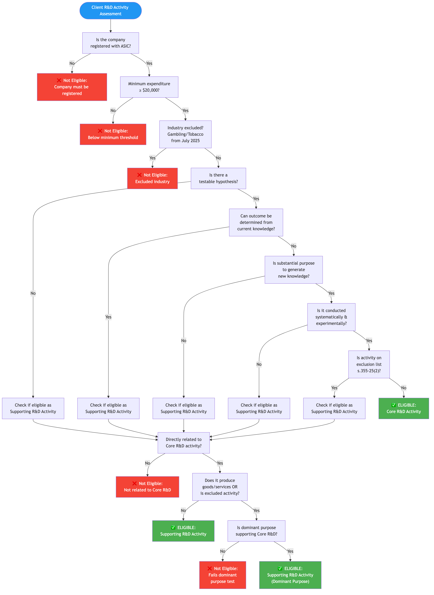

---

## Core vs Supporting Activities Classification

This flowchart helps distinguish between Core and Supporting R&D activities:

```mermaid
flowchart TD
    Activity([\"R&D Activity<br/>Classification\"]) --> Type[\"Activity Type?\"]
    
    Type -->|Experimental| Core["Assess as Core R&D"]
    Type -->|Non-experimental| Support["Assess as Supporting R&D"]
    
    Core --> C1["Meets all 4<br/>Core criteria?"]
    
    C1 -->|Yes| C2["On exclusion<br/>list s.355-25(2)?"]
    C1 -->|No| NotCore["Cannot be Core R&D<br/>→ Try Supporting"]
    
    C2 -->|No| CoreR["✅ CORE R&D ACTIVITY<br/>Eligible at 43.5% or 38.5%"]
    C2 -->|Yes| NotCore
    
    Support --> S1["Directly related to<br/>Core R&D activity?"]
    NotCore --> S1
    
    S1 -->|No| NotElig["❌ NOT ELIGIBLE"]
    S1 -->|Yes| S2["Type of<br/>Supporting Activity?"]
    
    S2 -->|Standard| S3["✅ SUPPORTING R&D<br/>Standard Category"]
    S2 -->|Special Category| S4["Produces goods/services<br/>OR excluded activity?"]
    
    S4 -->|Yes| S5["Dominant purpose<br/>supporting Core R&D?"]
    S4 -->|No| S3
    
    S5 -->|Yes| S6["✅ SUPPORTING R&D<br/>Special Category<br/>(Dominant Purpose Met)"]
    S5 -->|No| NotElig2["❌ NOT ELIGIBLE<br/>Fails dominant purpose"]
    
    CoreR --> Examples1["Examples:<br/>• New algorithm development<br/>• Novel material synthesis<br/>• Unprecedented integration<br/>• Performance breakthrough"]
    
    S3 --> Examples2["Examples:<br/>• Literature reviews<br/>• Data analysis<br/>• Testing protocols<br/>• Project management"]
    
    S6 --> Examples3["Examples:<br/>• Prototype production<br/>• Pilot plant operations<br/>• Field trials<br/>• Beta testing"]
    
    style CoreR fill:#4CAF50,color:#fff
    style S3 fill:#8BC34A,color:#fff
    style S6 fill:#8BC34A,color:#fff
    style NotElig fill:#f44336,color:#fff
    style NotElig2 fill:#f44336,color:#fff
    style Activity fill:#2196F3,color:#fff
```

**Visual Chart:**
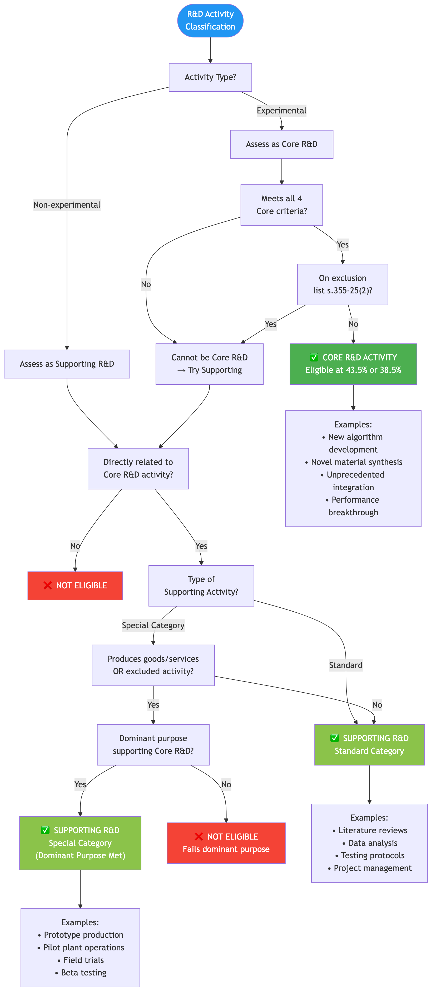

### Excluded Activities (s.355-25(2))
These activities **cannot** be Core R&D but **may** qualify as Supporting R&D:

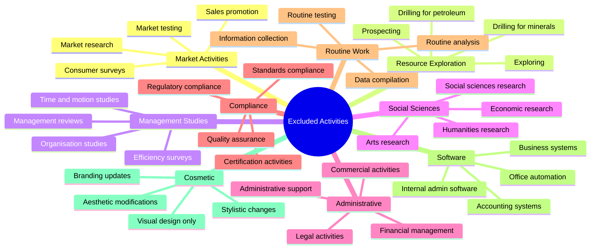
```mermaid
mindmap
  root((Excluded Activities))
    Market Activities
      Market research
      Sales promotion
      Market testing
      Consumer surveys
    Resource Exploration
      Prospecting
      Exploring
      Drilling for minerals
      Drilling for petroleum
    Management Studies
      Efficiency surveys
      Management reviews
      Organisation studies
      Time and motion studies
    Social Sciences
      Arts research
      Humanities research
      Social sciences research
      Economic research
    Administrative
      Commercial activities
      Legal activities
      Administrative support
      Financial management
    Compliance
      Regulatory compliance
      Standards compliance
      Quality assurance
      Certification activities
    Routine Work
      Routine testing
      Routine analysis
      Information collection
      Data compilation
    Software
      Internal admin software
      Business systems
      Office automation
      Accounting systems
    Cosmetic
      Stylistic changes
      Aesthetic modifications
      Branding updates
      Visual design only
```

**Visual Chart:**
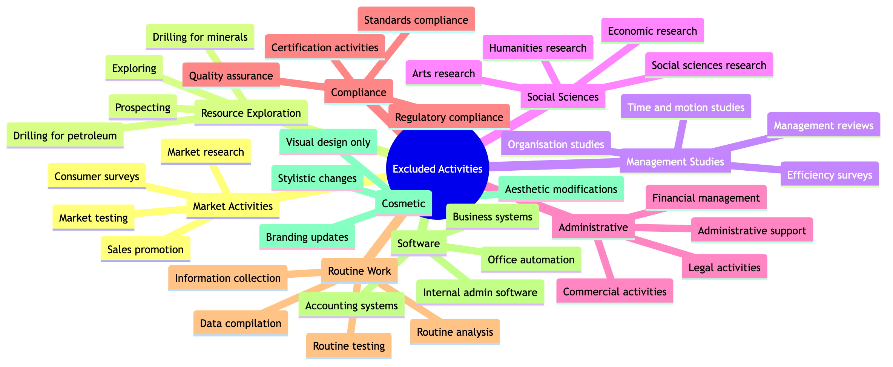

---

## Documentation Requirements Flow

This comprehensive flowchart shows the documentation process from project inception to ATO review:

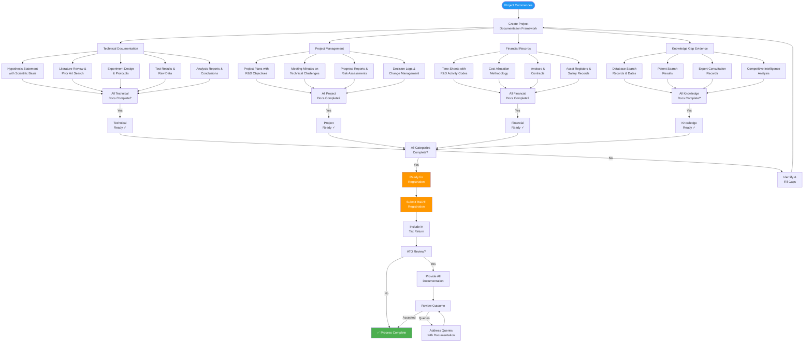
```mermaid
flowchart TD
    Start(["Project Commences"]) --> Doc1["Create Project<br/>Documentation Framework"]
    
    Doc1 --> Tech["Technical Documentation"]
    Doc1 --> Proj["Project Management"]
    Doc1 --> Fin["Financial Records"]
    Doc1 --> Know["Knowledge Gap Evidence"]
    
    Tech --> T1["Hypothesis Statement<br/>with Scientific Basis"]
    Tech --> T2["Literature Review &<br/>Prior Art Search"]
    Tech --> T3["Experiment Design<br/>& Protocols"]
    Tech --> T4["Test Results &<br/>Raw Data"]
    Tech --> T5["Analysis Reports &<br/>Conclusions"]
    
    T1 --> TCheck["All Technical<br/>Docs Complete?"]
    T2 --> TCheck
    T3 --> TCheck
    T4 --> TCheck
    T5 --> TCheck
    
    Proj --> P1["Project Plans with<br/>R&D Objectives"]
    Proj --> P2["Meeting Minutes on<br/>Technical Challenges"]
    Proj --> P3["Progress Reports &<br/>Risk Assessments"]
    Proj --> P4["Decision Logs &<br/>Change Management"]
    
    P1 --> PCheck["All Project<br/>Docs Complete?"]
    P2 --> PCheck
    P3 --> PCheck
    P4 --> PCheck
    
    Fin --> F1["Time Sheets with<br/>R&D Activity Codes"]
    Fin --> F2["Cost Allocation<br/>Methodology"]
    Fin --> F3["Invoices &<br/>Contracts"]
    Fin --> F4["Asset Registers &<br/>Salary Records"]
    
    F1 --> FCheck["All Financial<br/>Docs Complete?"]
    F2 --> FCheck
    F3 --> FCheck
    F4 --> FCheck
    
    Know --> K1["Database Search<br/>Records & Dates"]
    Know --> K2["Patent Search<br/>Results"]
    Know --> K3["Expert Consultation<br/>Records"]
    Know --> K4["Competitive Intelligence<br/>Analysis"]
    
    K1 --> KCheck["All Knowledge<br/>Docs Complete?"]
    K2 --> KCheck
    K3 --> KCheck
    K4 --> KCheck
    
    TCheck -->|Yes| Ready1["Technical<br/>Ready ✓"]
    PCheck -->|Yes| Ready2["Project<br/>Ready ✓"]
    FCheck -->|Yes| Ready3["Financial<br/>Ready ✓"]
    KCheck -->|Yes| Ready4["Knowledge<br/>Ready ✓"]
    
    Ready1 --> Final["All Categories<br/>Complete?"]
    Ready2 --> Final
    Ready3 --> Final
    Ready4 --> Final
    
    Final -->|Yes| Reg["Ready for<br/>Registration"]
    Final -->|No| Gap["Identify &<br/>Fill Gaps"]
    
    Gap --> Doc1
    
    Reg --> Submit["Submit R&DTI<br/>Registration"]
    Submit --> Tax["Include in<br/>Tax Return"]
    Tax --> Review["ATO Review?"]
    
    Review -->|No| Complete["✅ Process Complete"]
    Review -->|Yes| Provide["Provide All<br/>Documentation"]
    
    Provide --> Outcome["Review Outcome"]
    Outcome -->|Accepted| Complete
    Outcome -->|Queries| Address["Address Queries<br/>with Documentation"]
    Address --> Outcome
    
    style Start fill:#2196F3,color:#fff
    style Complete fill:#4CAF50,color:#fff
    style Reg fill:#FF9800,color:#fff
    style Submit fill:#FF9800,color:#fff
```

**Visual Chart:**
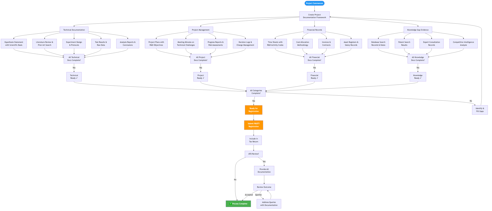

### Documentation Best Practices Checklist

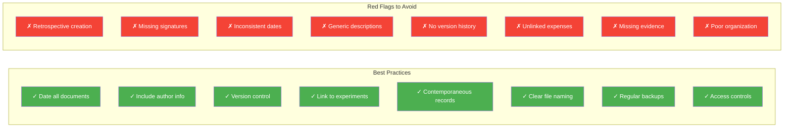
```mermaid
flowchart LR
    subgraph BP["Best Practices"]
        BP1["✓ Date all documents"]
        BP2["✓ Include author info"]
        BP3["✓ Version control"]
        BP4["✓ Link to experiments"]
        BP5["✓ Contemporaneous records"]
        BP6["✓ Clear file naming"]
        BP7["✓ Regular backups"]
        BP8["✓ Access controls"]
    end
    
    subgraph RF["Red Flags to Avoid"]
        RF1["✗ Retrospective creation"]
        RF2["✗ Missing signatures"]
        RF3["✗ Inconsistent dates"]
        RF4["✗ Generic descriptions"]
        RF5["✗ No version history"]
        RF6["✗ Unlinked expenses"]
        RF7["✗ Missing evidence"]
        RF8["✗ Poor organization"]
    end
    
    style BP1 fill:#4CAF50,color:#fff
    style BP2 fill:#4CAF50,color:#fff
    style BP3 fill:#4CAF50,color:#fff
    style BP4 fill:#4CAF50,color:#fff
    style BP5 fill:#4CAF50,color:#fff
    style BP6 fill:#4CAF50,color:#fff
    style BP7 fill:#4CAF50,color:#fff
    style BP8 fill:#4CAF50,color:#fff
    style RF1 fill:#f44336,color:#fff
    style RF2 fill:#f44336,color:#fff
    style RF3 fill:#f44336,color:#fff
    style RF4 fill:#f44336,color:#fff
    style RF5 fill:#f44336,color:#fff
    style RF6 fill:#f44336,color:#fff
    style RF7 fill:#f44336,color:#fff
    style RF8 fill:#f44336,color:#fff
```

**Visual Chart:**
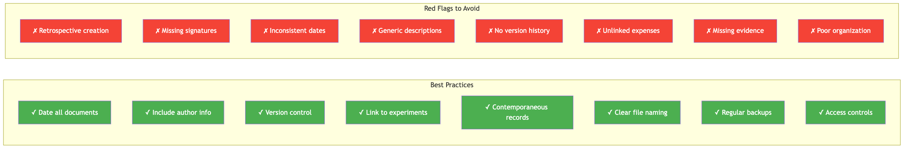

---

## Technical Uncertainty Framework

This flowchart assesses whether genuine technical uncertainty exists:

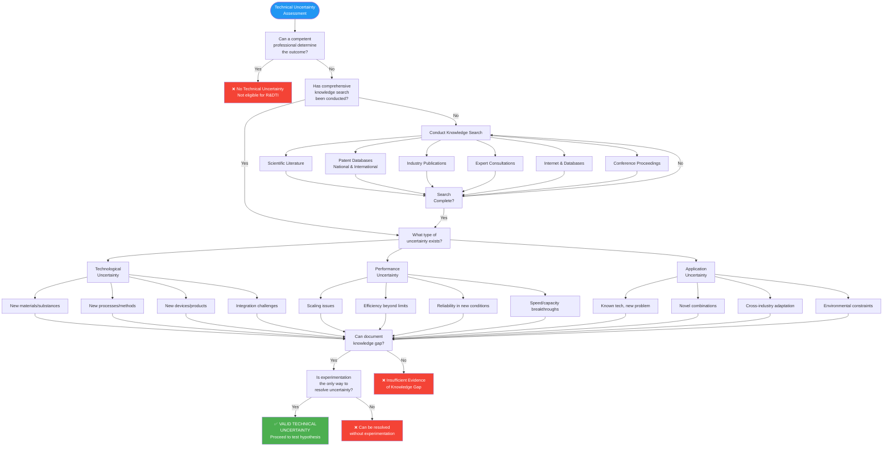
```mermaid
flowchart TD
    Start(["Technical Uncertainty<br/>Assessment"]) --> Q1["Can a competent<br/>professional determine<br/>the outcome?"]
    
    Q1 -->|Yes| NoUnc["❌ No Technical Uncertainty<br/>Not eligible for R&DTI"]
    Q1 -->|No| Q2["Has comprehensive<br/>knowledge search<br/>been conducted?"]
    
    Q2 -->|No| Search["Conduct Knowledge Search"]
    Q2 -->|Yes| Q3["What type of<br/>uncertainty exists?"]
    
    Search --> S1["Scientific Literature"]
    Search --> S2["Patent Databases<br/>National & International"]
    Search --> S3["Industry Publications"]
    Search --> S4["Expert Consultations"]
    Search --> S5["Internet & Databases"]
    Search --> S6["Conference Proceedings"]
    
    S1 --> SearchComp["Search<br/>Complete?"]
    S2 --> SearchComp
    S3 --> SearchComp
    S4 --> SearchComp
    S5 --> SearchComp
    S6 --> SearchComp
    
    SearchComp -->|Yes| Q3
    SearchComp -->|No| Search
    
    Q3 --> Tech["Technological<br/>Uncertainty"]
    Q3 --> Perf["Performance<br/>Uncertainty"]
    Q3 --> App["Application<br/>Uncertainty"]
    
    Tech --> T1["New materials/substances"]
    Tech --> T2["New processes/methods"]
    Tech --> T3["New devices/products"]
    Tech --> T4["Integration challenges"]
    
    Perf --> P1["Scaling issues"]
    Perf --> P2["Efficiency beyond limits"]
    Perf --> P3["Reliability in new conditions"]
    Perf --> P4["Speed/capacity breakthroughs"]
    
    App --> A1["Known tech, new problem"]
    App --> A2["Novel combinations"]
    App --> A3["Cross-industry adaptation"]
    App --> A4["Environmental constraints"]
    
    T1 --> Valid1["Can document<br/>knowledge gap?"]
    T2 --> Valid1
    T3 --> Valid1
    T4 --> Valid1
    P1 --> Valid1
    P2 --> Valid1
    P3 --> Valid1
    P4 --> Valid1
    A1 --> Valid1
    A2 --> Valid1
    A3 --> Valid1
    A4 --> Valid1
    
    Valid1 -->|Yes| Q4["Is experimentation<br/>the only way to<br/>resolve uncertainty?"]
    Valid1 -->|No| NoUnc2["❌ Insufficient Evidence<br/>of Knowledge Gap"]
    
    Q4 -->|Yes| Valid["✅ VALID TECHNICAL<br/>UNCERTAINTY<br/>Proceed to test hypothesis"]
    Q4 -->|No| NoUnc3["❌ Can be resolved<br/>without experimentation"]
    
    style Start fill:#2196F3,color:#fff
    style Valid fill:#4CAF50,color:#fff
    style NoUnc fill:#f44336,color:#fff
    style NoUnc2 fill:#f44336,color:#fff
    style NoUnc3 fill:#f44336,color:#fff
```

**Visual Chart:**
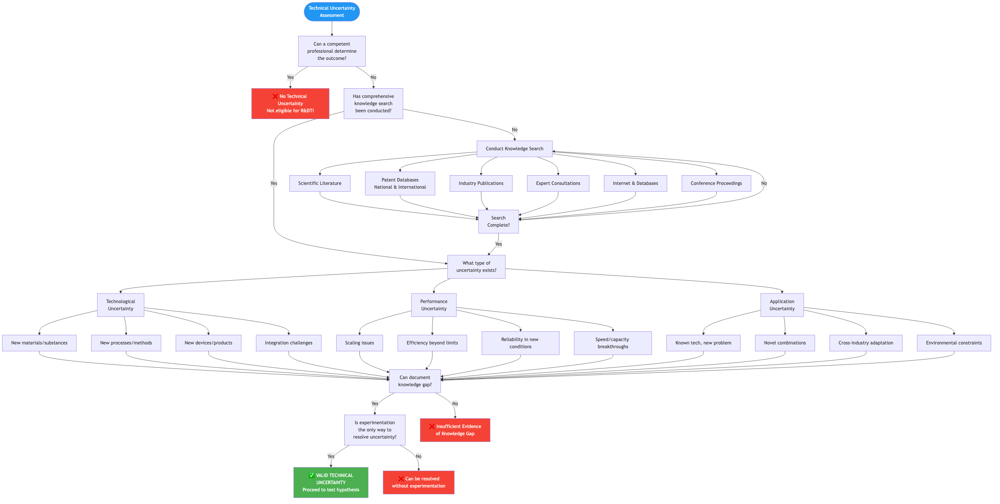

### Competent Professional Standard

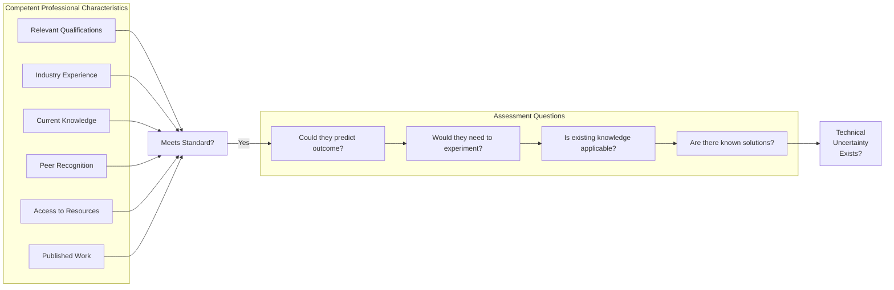
```mermaid
flowchart LR
    subgraph CPC["Competent Professional Characteristics"]
        CP1["Relevant Qualifications"]
        CP2["Industry Experience"]
        CP3["Current Knowledge"]
        CP4["Peer Recognition"]
        CP5["Access to Resources"]
        CP6["Published Work"]
    end
    
    subgraph AQ["Assessment Questions"]
        AQ1["Could they predict outcome?"]
        AQ2["Would they need to experiment?"]
        AQ3["Is existing knowledge applicable?"]
        AQ4["Are there known solutions?"]
    end
    
    CP1 --> Decision["Meets Standard?"]
    CP2 --> Decision
    CP3 --> Decision
    CP4 --> Decision
    CP5 --> Decision
    CP6 --> Decision
    
    Decision -->|Yes| AQ1
    AQ1 --> AQ2
    AQ2 --> AQ3
    AQ3 --> AQ4
    
    AQ4 --> Result["Technical<br/>Uncertainty<br/>Exists?"]
```

**Visual Chart:**
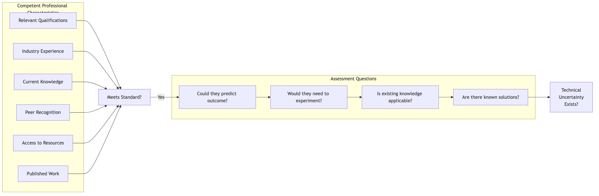

---

## Systematic Progression Process

This flowchart shows the required systematic experimental approach:

```mermaid
flowchart TD
    Start(["Begin R&D Activity"]) --> Phase1["📋 Phase 1: Hypothesis Formation"]
    
    Phase1 --> H1["Define Problem Statement"]
    H1 --> H2["Review Scientific Principles"]
    H2 --> H3["Formulate Testable Hypothesis"]
    H3 --> H4["Set Success Criteria"]
    H4 --> H5["Document Assumptions"]
    
    H5 --> Check1["Hypothesis<br/>Valid?"]
    Check1 -->|No| H1
    Check1 -->|Yes| Phase2["🔬 Phase 2: Experimental Design"]
    
    Phase2 --> E1["Identify Variables"]
    E1 --> E2["Design Controls"]
    E2 --> E3["Define Test Parameters"]
    E3 --> E4["Specify Measurements"]
    E4 --> E5["Plan Statistical Analysis"]
    
    E5 --> Check2["Design<br/>Sound?"]
    Check2 -->|No| E1
    Check2 -->|Yes| Phase3["📊 Phase 3: Experimentation"]
    
    Phase3 --> X1["Conduct Experiments"]
    X1 --> X2["Record Observations"]
    X2 --> X3["Collect Raw Data"]
    X3 --> X4["Note Anomalies"]
    X4 --> X5["Maintain Lab Notebooks"]
    
    X5 --> Check3["Data<br/>Complete?"]
    Check3 -->|No| X1
    Check3 -->|Yes| Phase4["📈 Phase 4: Analysis & Evaluation"]
    
    Phase4 --> A1["Process Raw Data"]
    A1 --> A2["Statistical Analysis"]
    A2 --> A3["Compare to Hypothesis"]
    A3 --> A4["Identify Patterns"]
    A4 --> A5["Analyze Failures"]
    
    A5 --> Check4["Analysis<br/>Complete?"]
    Check4 -->|No| A1
    Check4 -->|Yes| Phase5["💡 Phase 5: Conclusions"]
    
    Phase5 --> C1["Summarize Findings"]
    C1 --> C2["Address Hypothesis"]
    C2 --> C3["Document New Knowledge"]
    C3 --> C4["Identify Next Steps"]
    C4 --> C5["Record Lessons Learned"]
    
    C5 --> Decision["Objective<br/>Achieved?"]
    
    Decision -->|Yes| Success["✅ R&D COMPLETE<br/>Document for Registration"]
    Decision -->|No| Iterate["Continue<br/>Research?"]
    
    Iterate -->|Yes| NewHyp["Refine Hypothesis"]
    Iterate -->|No| Stop["Document Learnings<br/>Consider Pivot"]
    
    NewHyp --> Phase1
    
    style Start fill:#2196F3,color:#fff
    style Phase1 fill:#9C27B0,color:#fff
    style Phase2 fill:#673AB7,color:#fff
    style Phase3 fill:#3F51B5,color:#fff
    style Phase4 fill:#2196F3,color:#fff
    style Phase5 fill:#009688,color:#fff
    style Success fill:#4CAF50,color:#fff
    style Stop fill:#FF9800,color:#fff
```

**Visual Chart:**
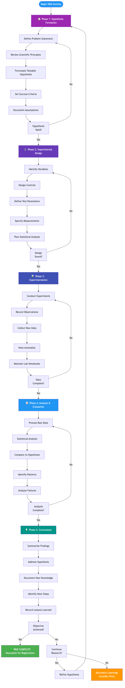

### Documentation Requirements per Phase

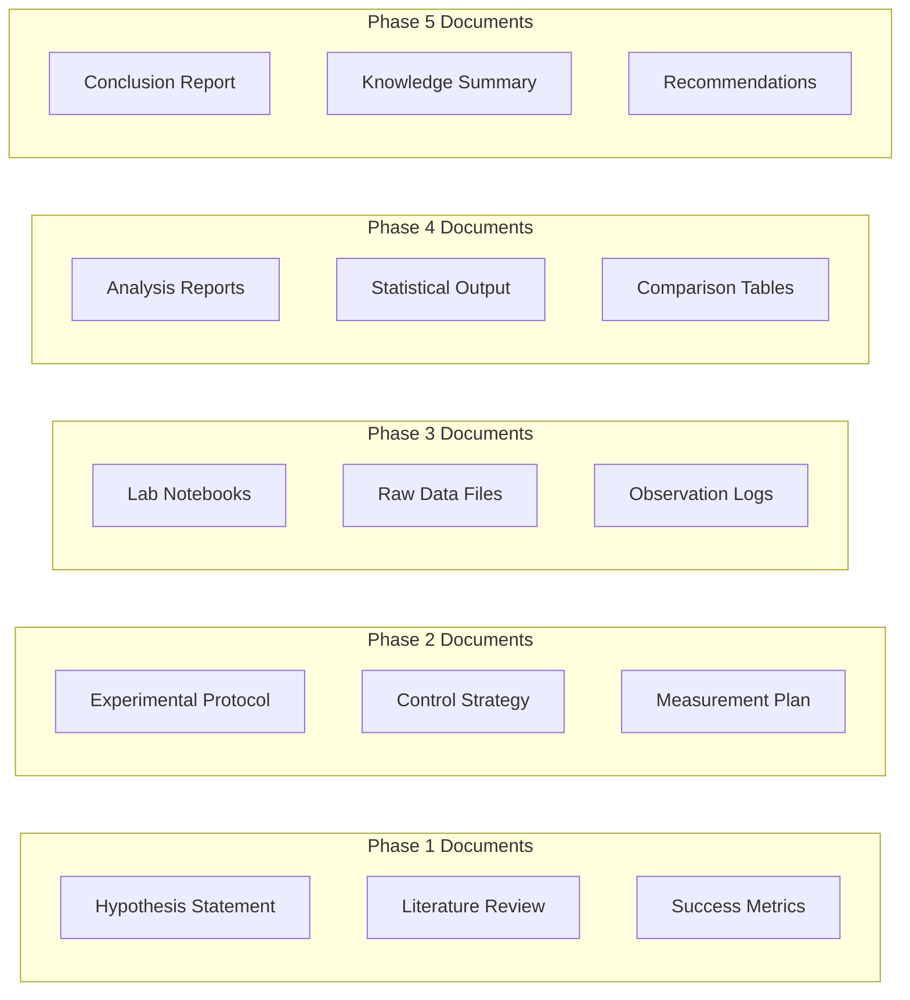
```mermaid
flowchart LR
    subgraph P1["Phase 1 Documents"]
        D1A["Hypothesis Statement"]
        D1B["Literature Review"]
        D1C["Success Metrics"]
    end
    
    subgraph P2["Phase 2 Documents"]
        D2A["Experimental Protocol"]
        D2B["Control Strategy"]
        D2C["Measurement Plan"]
    end
    
    subgraph P3["Phase 3 Documents"]
        D3A["Lab Notebooks"]
        D3B["Raw Data Files"]
        D3C["Observation Logs"]
    end
    
    subgraph P4["Phase 4 Documents"]
        D4A["Analysis Reports"]
        D4B["Statistical Output"]
        D4C["Comparison Tables"]
    end
    
    subgraph P5["Phase 5 Documents"]
        D5A["Conclusion Report"]
        D5B["Knowledge Summary"]
        D5C["Recommendations"]
    end
```

**Visual Chart:**
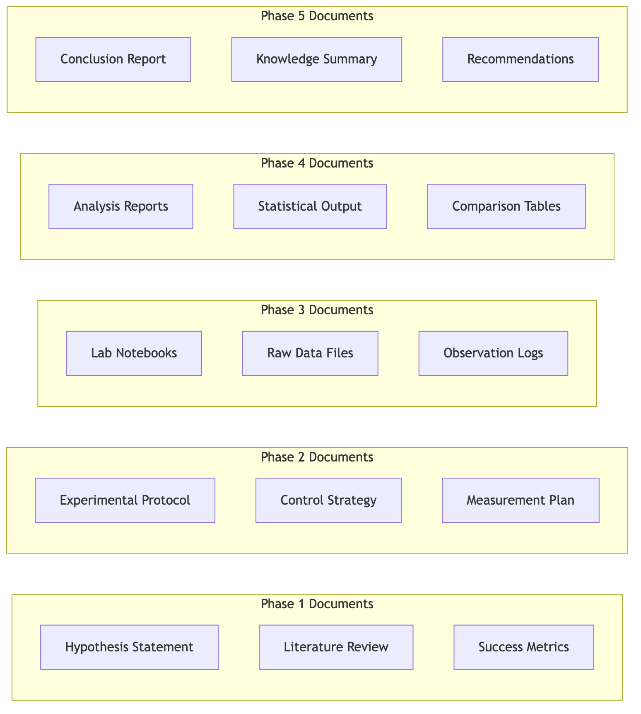

---

## Industry Knowledge Evaluation

This flowchart helps determine if the knowledge gap is genuine:

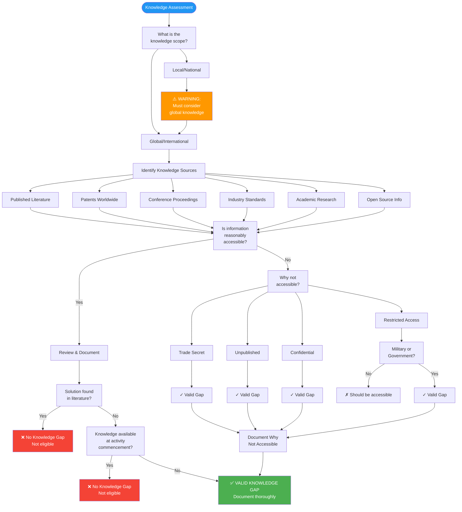
```mermaid
flowchart TD
    Start(["Knowledge Assessment"]) --> Q1["What is the<br/>knowledge scope?"]
    
    Q1 --> Local["Local/National"]
    Q1 --> Global["Global/International"]
    
    Local --> Warning["⚠️ WARNING:<br/>Must consider<br/>global knowledge"]
    Warning --> Global
    
    Global --> Sources["Identify Knowledge Sources"]
    
    Sources --> S1["Published Literature"]
    Sources --> S2["Patents Worldwide"]
    Sources --> S3["Conference Proceedings"]
    Sources --> S4["Industry Standards"]
    Sources --> S5["Academic Research"]
    Sources --> S6["Open Source Info"]
    
    S1 --> Access["Is information<br/>reasonably<br/>accessible?"]
    S2 --> Access
    S3 --> Access
    S4 --> Access
    S5 --> Access
    S6 --> Access
    
    Access -->|Yes| Review["Review & Document"]
    Access -->|No| Check["Why not<br/>accessible?"]
    
    Check --> Trade["Trade Secret"]
    Check --> Unpub["Unpublished"]
    Check --> Confid["Confidential"]
    Check --> Restrict["Restricted Access"]
    
    Trade --> Valid1["✓ Valid Gap"]
    Unpub --> Valid2["✓ Valid Gap"]
    Confid --> Valid3["✓ Valid Gap"]
    Restrict --> Assess["Military or<br/>Government?"]
    
    Assess -->|Yes| Valid4["✓ Valid Gap"]
    Assess -->|No| Invalid["✗ Should be accessible"]
    
    Review --> Found["Solution found<br/>in literature?"]
    
    Found -->|Yes| NoGap["❌ No Knowledge Gap<br/>Not eligible"]
    Found -->|No| Timing["Knowledge available<br/>at activity<br/>commencement?"]
    
    Timing -->|Yes| NoGap2["❌ No Knowledge Gap<br/>Not eligible"]
    Timing -->|No| GapValid["✅ VALID KNOWLEDGE GAP<br/>Document thoroughly"]
    
    Valid1 --> Document["Document Why<br/>Not Accessible"]
    Valid2 --> Document
    Valid3 --> Document
    Valid4 --> Document
    
    Document --> GapValid
    
    style Start fill:#2196F3,color:#fff
    style GapValid fill:#4CAF50,color:#fff
    style NoGap fill:#f44336,color:#fff
    style NoGap2 fill:#f44336,color:#fff
    style Warning fill:#FF9800,color:#fff
```

**Visual Chart:**
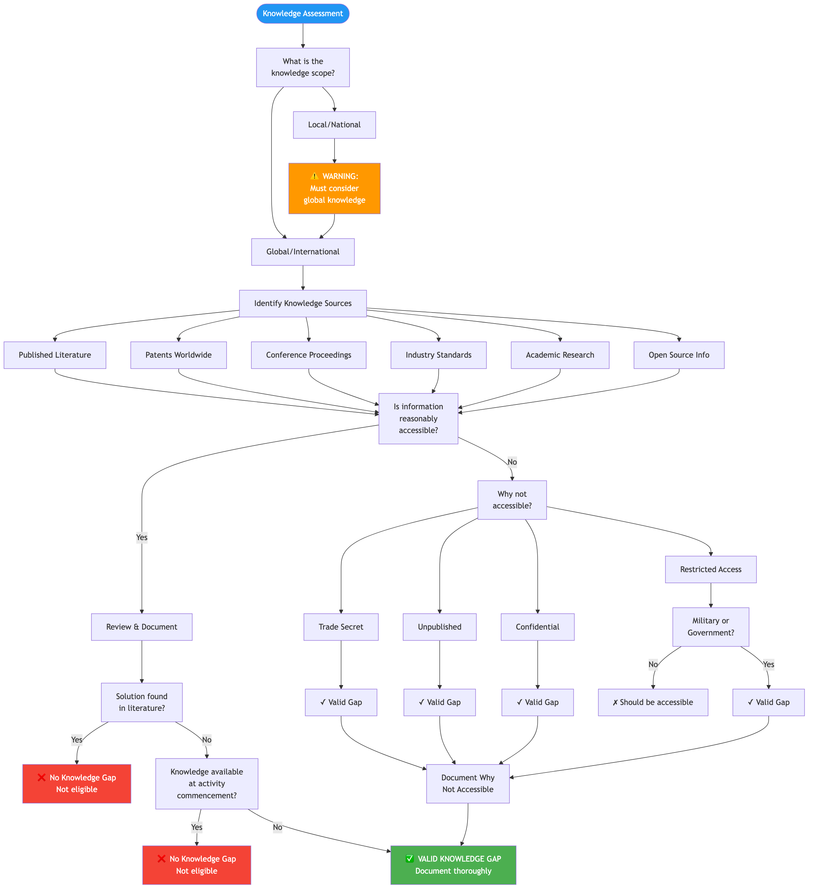

### Industry-Specific Knowledge Considerations

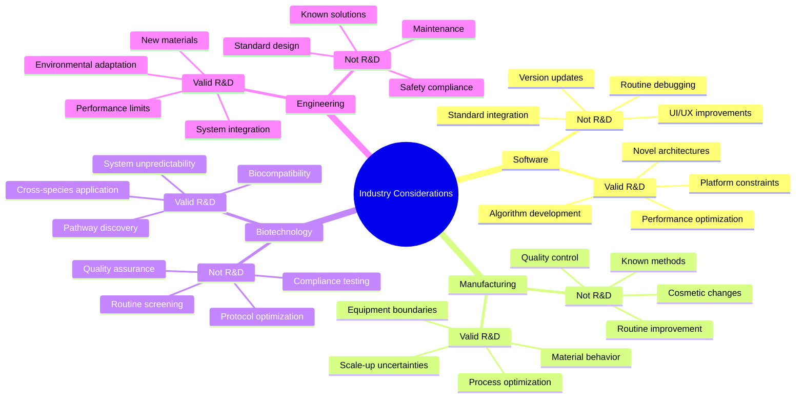
```mermaid
mindmap
  root((Industry Considerations))
    Software
      Valid R&D
        Algorithm development
        Platform constraints
        Performance optimization
        Novel architectures
      Not R&D
        Routine debugging
        Standard integration
        UI/UX improvements
        Version updates
    Manufacturing
      Valid R&D
        Scale-up uncertainties
        Material behavior
        Process optimization
        Equipment boundaries
      Not R&D
        Routine improvement
        Quality control
        Known methods
        Cosmetic changes
    Biotechnology
      Valid R&D
        System unpredictability
        Cross-species application
        Pathway discovery
        Biocompatibility
      Not R&D
        Routine screening
        Protocol optimization
        Compliance testing
        Quality assurance
    Engineering
      Valid R&D
        New materials
        System integration
        Performance limits
        Environmental adaptation
      Not R&D
        Standard design
        Known solutions
        Safety compliance
        Maintenance
```

**Visual Chart:**
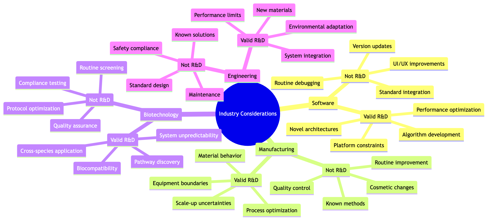

---

## Compliance Timeline

Visual timeline for R&DTI compliance activities:

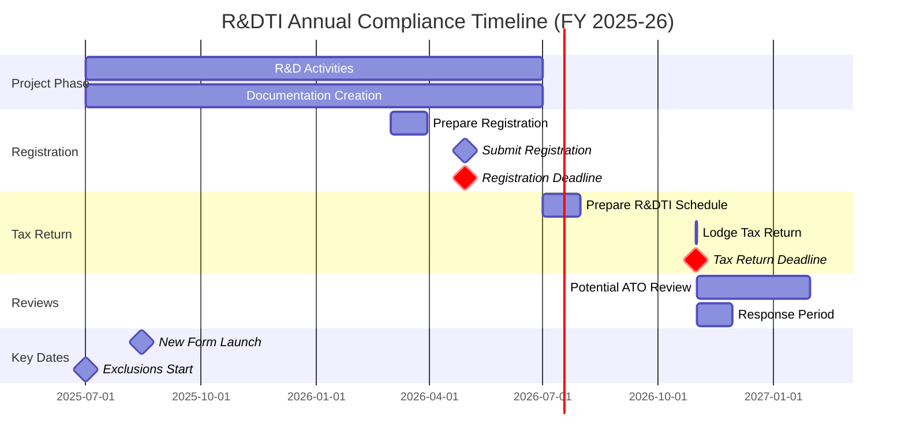
```mermaid
gantt
    title R&DTI Annual Compliance Timeline (FY 2025-26)
    dateFormat YYYY-MM-DD
    section Project Phase
    R&D Activities           :rd, 2025-07-01, 365d
    Documentation Creation    :doc, 2025-07-01, 365d
    
    section Registration
    Prepare Registration      :prep, 2026-03-01, 30d
    Submit Registration      :milestone, submit, 2026-04-30, 0d
    Registration Deadline    :crit, milestone, regdead, 2026-04-30, 0d
    
    section Tax Return
    Prepare R&DTI Schedule   :taxprep, 2026-07-01, 30d
    Lodge Tax Return         :lodge, 2026-10-31, 1d
    Tax Return Deadline      :crit, milestone, taxdead, 2026-10-31, 0d
    
    section Reviews
    Potential ATO Review     :review, 2026-11-01, 90d
    Response Period          :response, 2026-11-01, 28d
    
    section Key Dates
    New Form Launch          :milestone, newform, 2025-08-15, 0d
    Exclusions Start         :milestone, excl, 2025-07-01, 0d
```

**Visual Chart:**
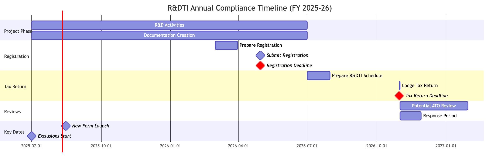

### Monthly Compliance Checklist

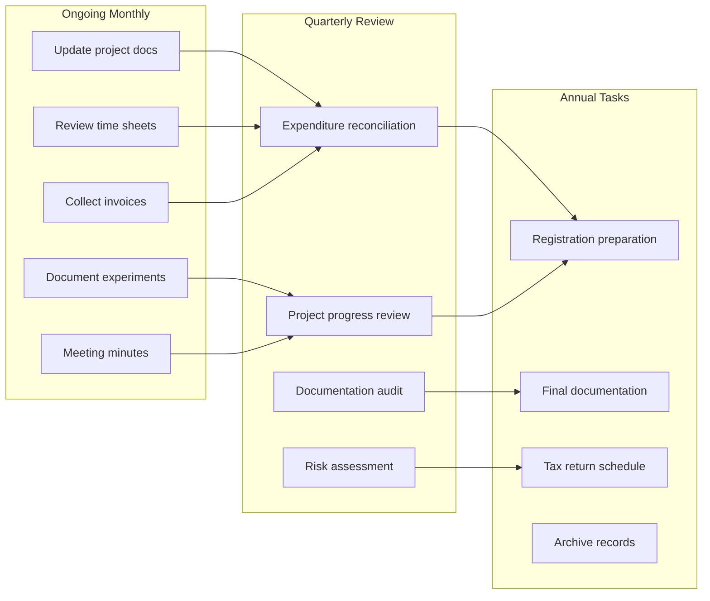
```mermaid
flowchart LR
    subgraph OM["Ongoing Monthly"]
        M1["Update project docs"]
        M2["Review time sheets"]
        M3["Collect invoices"]
        M4["Document experiments"]
        M5["Meeting minutes"]
    end
    
    subgraph QR["Quarterly Review"]
        Q1["Expenditure reconciliation"]
        Q2["Project progress review"]
        Q3["Documentation audit"]
        Q4["Risk assessment"]
    end
    
    subgraph AT["Annual Tasks"]
        A1["Registration preparation"]
        A2["Final documentation"]
        A3["Tax return schedule"]
        A4["Archive records"]
    end
    
    M1 --> Q1
    M2 --> Q1
    M3 --> Q1
    M4 --> Q2
    M5 --> Q2
    
    Q1 --> A1
    Q2 --> A1
    Q3 --> A2
    Q4 --> A3
```

**Visual Chart:**
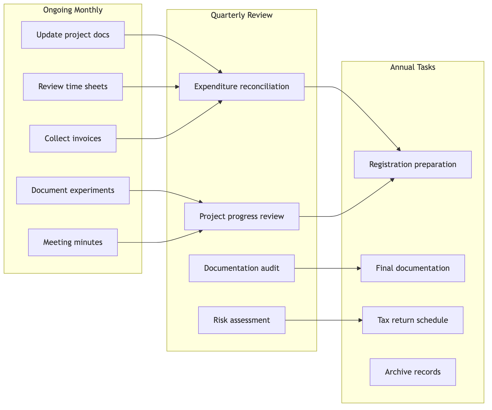

---

## Quick Reference Tables

### 🚫 Excluded Activities Reference

| Category | Examples | Can be Supporting R&D? |
|----------|----------|------------------------|
| **Market Activities** | Market research, sales promotion, consumer surveys | Yes, if dominant purpose test met |
| **Resource Exploration** | Prospecting, drilling for minerals/petroleum | Yes, if dominant purpose test met |
| **Management Studies** | Efficiency surveys, time & motion studies | Yes, if directly related to Core R&D |
| **Social Sciences** | Arts, humanities, social sciences research | Yes, if directly related to Core R&D |
| **Administrative** | Commercial, legal, financial management | Yes, if directly related to Core R&D |
| **Compliance** | Regulatory compliance, standards, QA | Yes, if dominant purpose test met |
| **Routine Work** | Routine testing, data collection | Yes, if directly related to Core R&D |
| **Internal Software** | Admin systems, office automation | Yes, if dominant purpose test met |
| **Cosmetic Changes** | Stylistic modifications, branding | Yes, if dominant purpose test met |

### 📋 Registration Requirements Checklist

#### Company Information
- [ ] ABN and ACN
- [ ] ASIC registration confirmation
- [ ] Country of incorporation
- [ ] Tax residency status
- [ ] Consolidated group status
- [ ] Tax-exempt entity control percentage
- [ ] Indigenous ownership status
- [ ] Primary ANZSIC code

#### Financial Information
- [ ] Aggregated turnover
- [ ] Taxable income/loss
- [ ] Export sales revenue
- [ ] Total employees (headcount)
- [ ] FTE employees in R&D
- [ ] Estimated R&D expenditure

#### Project Information (per project)
- [ ] Project name and reference
- [ ] Expected duration
- [ ] Total expected expenditure
- [ ] Project objectives (1,000 chars)
- [ ] Primary location (postcode)
- [ ] Field of research (ANZSRC code)
- [ ] Feedstock inputs (if applicable)

#### Core Activity Requirements (per activity)
- [ ] Activity name and dates
- [ ] Hypothesis (4,000 chars)
- [ ] New knowledge intended (1,000 chars)
- [ ] Knowledge search conducted
- [ ] Experiment description (4,000 chars)
- [ ] Results evaluation (4,000 chars)
- [ ] Conclusions reached (4,000 chars)
- [ ] Evidence maintained

#### Supporting Activity Requirements
- [ ] Activity name and dates
- [ ] Description (1,000 chars)
- [ ] Related Core R&D activities
- [ ] Direct relationship explanation
- [ ] Dominant purpose declaration (if required)
- [ ] Estimated expenditure

### 💡 Common Scenarios Quick Assessment

| Scenario | Likely Eligible? | Key Consideration |
|----------|-----------------|-------------------|
| Developing new algorithm for unprecedented problem | ✅ Yes | Must show current algorithms inadequate |
| Scaling lab process to production | ✅ Possibly | Must demonstrate scale-up uncertainties |
| Implementing known software in new environment | ⚠️ Maybe | Only if platform creates genuine constraints |
| Optimizing existing process | ⚠️ Maybe | Must exceed current industry knowledge |
| Routine product testing | ❌ No | Unless testing new hypotheses |
| Compliance with new regulations | ❌ No | Unless developing new methods |
| Bug fixing in software | ❌ No | Unless bugs reveal fundamental issues |
| Market research for new product | ❌ No | But can be Supporting if for R&D product |
| Training staff on new technology | ❌ No | Unless developing training methods |
| Purchasing R&D equipment | ⚠️ Maybe | Depreciation may be eligible |

---

## Critical Success Factors

```mermaid
flowchart TD
    Success(["R&DTI Success Factors"]) --> F1["Strong Documentation"]
    Success --> F2["Clear Hypothesis"]
    Success --> F3["Genuine Uncertainty"]
    Success --> F4["Systematic Approach"]
    Success --> F5["Timely Registration"]
    Success --> F6["Accurate Claims"]
    
    F1 --> D1["✓ Contemporaneous records"]
    F1 --> D2["✓ Technical evidence"]
    F1 --> D3["✓ Financial substantiation"]
    
    F2 --> H1["✓ Scientific basis"]
    F2 --> H2["✓ Testable proposition"]
    F2 --> H3["✓ Clear metrics"]
    
    F3 --> U1["✓ Global knowledge search"]
    F3 --> U2["✓ Expert validation"]
    F3 --> U3["✓ Documented gaps"]
    
    F4 --> S1["✓ Experimental method"]
    F4 --> S2["✓ Logical progression"]
    F4 --> S3["✓ Evidence-based conclusions"]
    
    F5 --> T1["✓ 10-month deadline met"]
    F5 --> T2["✓ Complete information"]
    F5 --> T3["✓ Consistent details"]
    
    F6 --> C1["✓ Eligible activities only"]
    F6 --> C2["✓ Correct calculations"]
    F6 --> C3["✓ Proper allocations"]
    
    style Success fill:#2196F3,color:#fff
    style F1 fill:#4CAF50,color:#fff
    style F2 fill:#4CAF50,color:#fff
    style F3 fill:#4CAF50,color:#fff
    style F4 fill:#4CAF50,color:#fff
    style F5 fill:#4CAF50,color:#fff
    style F6 fill:#4CAF50,color:#fff
```

**Visual Chart:**
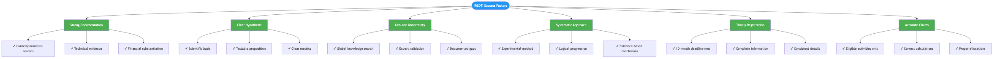

---

## Risk Management Matrix

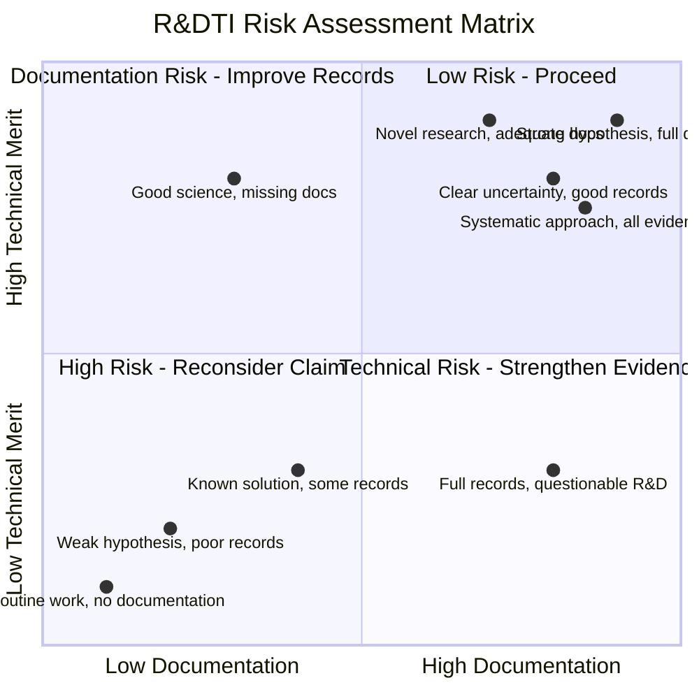
```mermaid
quadrantChart
    title R&DTI Risk Assessment Matrix
    x-axis "Low Documentation" --> "High Documentation"
    y-axis "Low Technical Merit" --> "High Technical Merit"
    quadrant-1 "Low Risk - Proceed"
    quadrant-2 "Documentation Risk - Improve Records"
    quadrant-3 "High Risk - Reconsider Claim"
    quadrant-4 "Technical Risk - Strengthen Evidence"
    
    "Strong hypothesis, full docs": [0.9, 0.9]
    "Clear uncertainty, good records": [0.8, 0.8]
    "Novel research, adequate docs": [0.7, 0.9]
    "Systematic approach, all evidence": [0.85, 0.75]
    "Weak hypothesis, poor records": [0.2, 0.2]
    "Routine work, no documentation": [0.1, 0.1]
    "Known solution, some records": [0.4, 0.3]
    "Good science, missing docs": [0.3, 0.8]
    "Full records, questionable R&D": [0.8, 0.3]
```

**Visual Chart:**
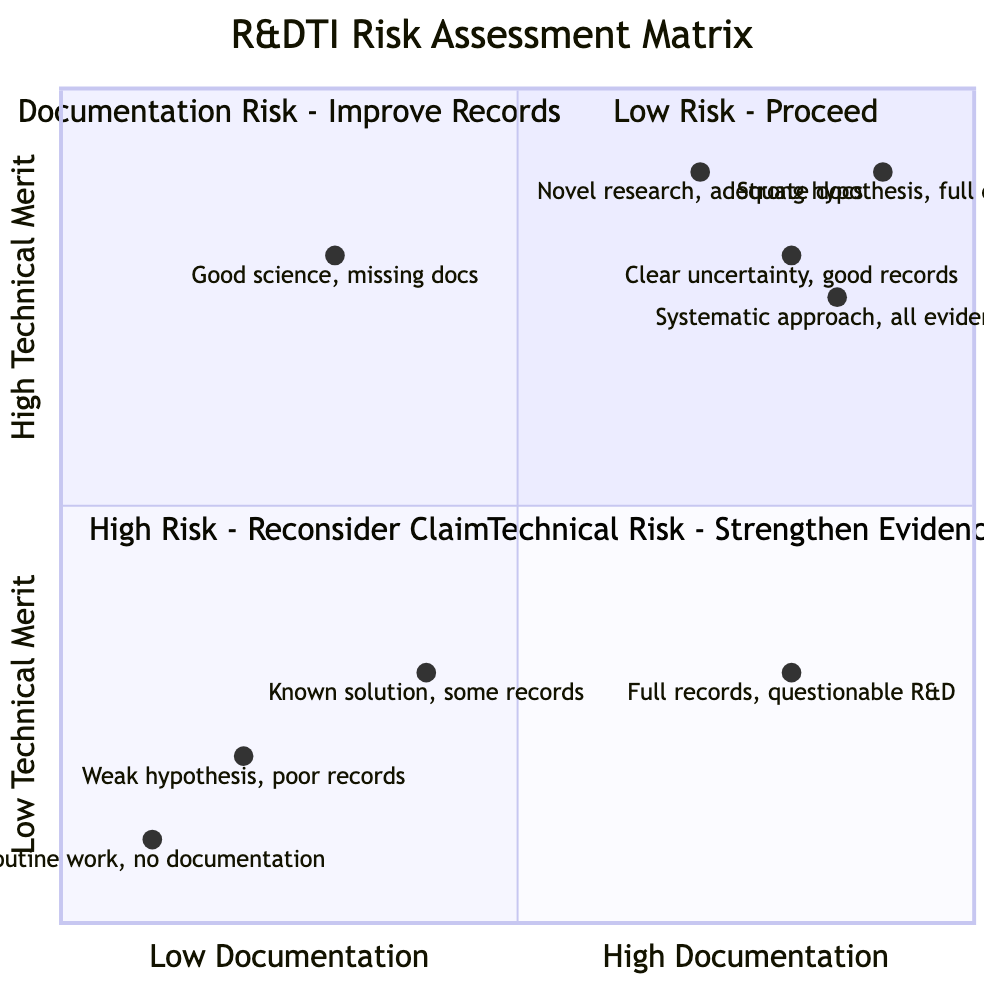

---

## Consultant Action Steps

### Initial Assessment Protocol

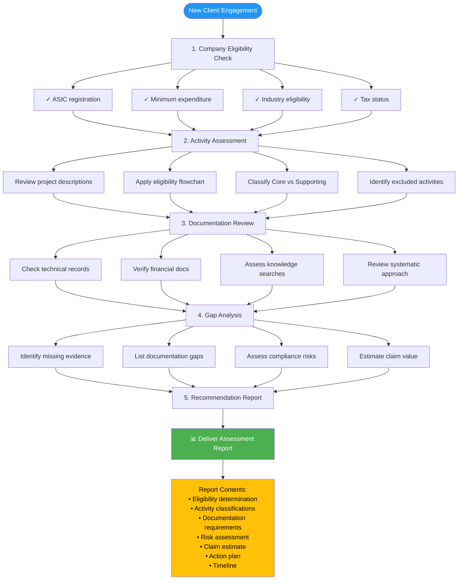
```mermaid
flowchart TD
    Client(["New Client Engagement"]) --> Step1["1. Company Eligibility Check"]
    
    Step1 --> S1A["✓ ASIC registration"]
    Step1 --> S1B["✓ Minimum expenditure"]
    Step1 --> S1C["✓ Industry eligibility"]
    Step1 --> S1D["✓ Tax status"]
    
    S1A --> Step2["2. Activity Assessment"]
    S1B --> Step2
    S1C --> Step2
    S1D --> Step2
    
    Step2 --> S2A["Review project descriptions"]
    Step2 --> S2B["Apply eligibility flowchart"]
    Step2 --> S2C["Classify Core vs Supporting"]
    Step2 --> S2D["Identify excluded activities"]
    
    S2A --> Step3["3. Documentation Review"]
    S2B --> Step3
    S2C --> Step3
    S2D --> Step3
    
    Step3 --> S3A["Check technical records"]
    Step3 --> S3B["Verify financial docs"]
    Step3 --> S3C["Assess knowledge searches"]
    Step3 --> S3D["Review systematic approach"]
    
    S3A --> Step4["4. Gap Analysis"]
    S3B --> Step4
    S3C --> Step4
    S3D --> Step4
    
    Step4 --> S4A["Identify missing evidence"]
    Step4 --> S4B["List documentation gaps"]
    Step4 --> S4C["Assess compliance risks"]
    Step4 --> S4D["Estimate claim value"]
    
    S4A --> Step5["5. Recommendation Report"]
    S4B --> Step5
    S4C --> Step5
    S4D --> Step5
    
    Step5 --> Report["📊 Deliver Assessment Report"]
    
    Report --> Contents["Report Contents:<br/>• Eligibility determination<br/>• Activity classifications<br/>• Documentation requirements<br/>• Risk assessment<br/>• Claim estimate<br/>• Action plan<br/>• Timeline"]
    
    style Client fill:#2196F3,color:#fff
    style Report fill:#4CAF50,color:#fff
    style Contents fill:#FFC107,color:#000
```

**Visual Chart:**
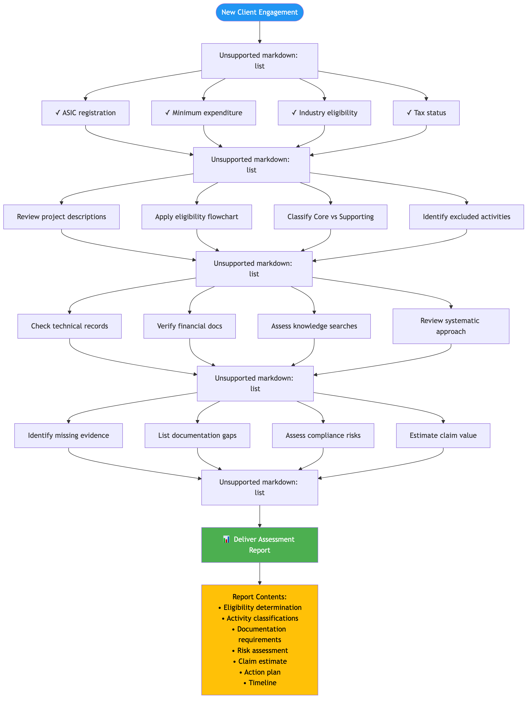

---

## Resources & References

### Legislative Framework
- **Income Tax Assessment Act 1997** - Division 355
- **Industry Research and Development Act 1986**
- **Income Tax Assessment Regulations 1997**

### Official Guidance
- [AusIndustry R&DTI Portal](https://business.gov.au/grants-and-programs/research-and-development-tax-incentive)
- [ATO R&D Tax Incentive](https://www.ato.gov.au/businesses-and-organisations/income-deductions-and-concessions/incentives-and-concessions/research-and-development-tax-incentive-and-concessions/)
- [Customer Portal](https://portal.business.gov.au)
- [R&DTI Guide to Interpretation](https://www.ato.gov.au/law/view/document?DocID=SAV/RDTI/00001)

### Key ATO Rulings
- **TR 2021/5** - Core R&D activities
- **TR 2021/6** - Supporting R&D activities  
- **TR 2024/1** - Excluded activities
- **PCG 2021/3** - Software development activities

### Important Dates
| Event | Date | Note |
|-------|------|------|
| **FY25 Exclusions Start** | 1 July 2025 | Gambling & tobacco excluded |
| **New Form Launch** | 15 August 2025 | All drafts deleted |
| **FY25 Registration Opens** | 1 July 2025 | Can register once activities commence |
| **FY25 Registration Deadline** | 30 April 2026 | No extensions granted |
| **FY25 Tax Return Deadline** | Varies by entity | Generally 31 Oct 2026 |

### Contact Information
- **AusIndustry Hotline**: 13 28 46
- **ATO R&DTI Helpline**: 1300 557 527
- **Email**: rdti@industry.gov.au

---

## Disclaimer

This guide is for general information purposes only and does not constitute professional tax advice. The R&D Tax Incentive is complex legislation that requires careful consideration of individual circumstances. Always:

1. Consult with registered tax agents for specific advice
2. Obtain private rulings for uncertain interpretations
3. Consider advance findings for high-risk activities
4. Maintain comprehensive contemporaneous documentation
5. Stay updated with latest ATO and AusIndustry guidance

The R&DTI exists to encourage genuine R&D that benefits the Australian economy. It is not a general business subsidy, and aggressive or inappropriate claims may result in penalties, interest charges, and reputational damage.

---

*Last Updated: August 2025*  
*Version: 2.0 - Enhanced with Visual Assessment Tools*  
*Next Review: Post August 15, 2025 form changes*

---

## Quick Links Navigation

[↑ Return to Top](#rd-tax-incentive-rdti-visual-assessment-guide) | [Eligibility Tree](#eligibility-decision-tree) | [Core vs Supporting](#core-vs-supporting-activities-classification) | [Documentation](#documentation-requirements-flow) | [Technical Uncertainty](#technical-uncertainty-framework) | [Systematic Process](#systematic-progression-process) | [Knowledge Evaluation](#industry-knowledge-evaluation) | [Timeline](#compliance-timeline) | [Quick Reference](#quick-reference-tables)