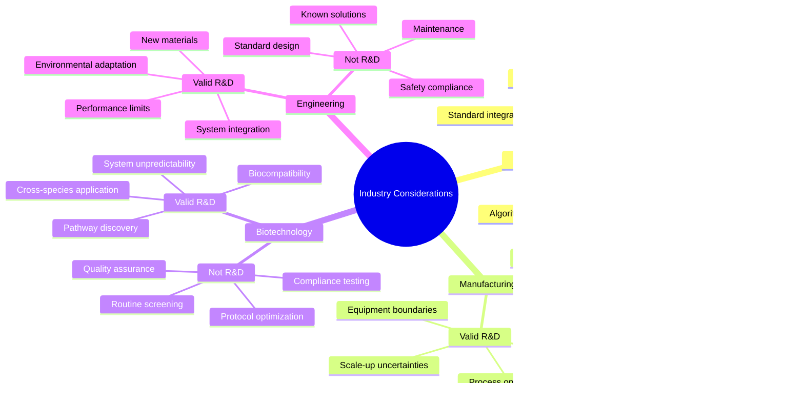

# R&D Tax Incentive (R&DTI) Visual Assessment Guide

## 🎯 Quick Navigation
- [Eligibility Decision Tree](#eligibility-decision-tree)
- [Core vs Supporting Activities Classification](#core-vs-supporting-activities-classification)
- [Documentation Requirements Flow](#documentation-requirements-flow)
- [Technical Uncertainty Framework](#technical-uncertainty-framework)
- [Systematic Progression Process](#systematic-progression-process)
- [Industry Knowledge Evaluation](#industry-knowledge-evaluation)
- [Compliance Timeline](#compliance-timeline)
- [Quick Reference Tables](#quick-reference-tables)

---

## Overview

The Australian R&D Tax Incentive provides significant tax offsets for eligible research and development activities. This guide provides visual decision-making tools to assess eligibility and ensure compliance with AusIndustry and ATO requirements.

### 💰 Tax Offset Rates
| Company Turnover | Tax Offset | Type | Formula |
|-----------------|------------|------|---------|
| < $20M | **43.5%** | Refundable | Corporate tax rate (25%) + 18.5% premium |
| ≥ $20M (0-2% R&D intensity) | **38.5%** | Non-refundable | Corporate tax rate (30%) + 8.5% premium |
| ≥ $20M (>2% R&D intensity) | **38.5%** | Non-refundable | Corporate tax rate (30%) + 16.5% premium |

### 📊 Key Thresholds
- **Minimum expenditure**: $20,000
- **Maximum expenditure**: $150 million per year
- **Registration deadline**: 10 months after income year end
- **New exclusions (July 1, 2025)**: Gambling and tobacco industries

---

## Eligibility Decision Tree

This comprehensive flowchart guides you through the complete eligibility assessment process:


**Visual Chart:**


---

## Core vs Supporting Activities Classification

This flowchart helps distinguish between Core and Supporting R&D activities:

```mermaid
flowchart TD
    Activity([\"R&D Activity<br/>Classification\"]) --> Type[\"Activity Type?\"]
    
    Type -->|Experimental| Core["Assess as Core R&D"]
    Type -->|Non-experimental| Support["Assess as Supporting R&D"]
    
    Core --> C1["Meets all 4<br/>Core criteria?"]
    
    C1 -->|Yes| C2["On exclusion<br/>list s.355-25(2)?"]
    C1 -->|No| NotCore["Cannot be Core R&D<br/>→ Try Supporting"]
    
    C2 -->|No| CoreR["✅ CORE R&D ACTIVITY<br/>Eligible at 43.5% or 38.5%"]
    C2 -->|Yes| NotCore
    
    Support --> S1["Directly related to<br/>Core R&D activity?"]
    NotCore --> S1
    
    S1 -->|No| NotElig["❌ NOT ELIGIBLE"]
    S1 -->|Yes| S2["Type of<br/>Supporting Activity?"]
    
    S2 -->|Standard| S3["✅ SUPPORTING R&D<br/>Standard Category"]
    S2 -->|Special Category| S4["Produces goods/services<br/>OR excluded activity?"]
    
    S4 -->|Yes| S5["Dominant purpose<br/>supporting Core R&D?"]
    S4 -->|No| S3
    
    S5 -->|Yes| S6["✅ SUPPORTING R&D<br/>Special Category<br/>(Dominant Purpose Met)"]
    S5 -->|No| NotElig2["❌ NOT ELIGIBLE<br/>Fails dominant purpose"]
    
    CoreR --> Examples1["Examples:<br/>• New algorithm development<br/>• Novel material synthesis<br/>• Unprecedented integration<br/>• Performance breakthrough"]
    
    S3 --> Examples2["Examples:<br/>• Literature reviews<br/>• Data analysis<br/>• Testing protocols<br/>• Project management"]
    
    S6 --> Examples3["Examples:<br/>• Prototype production<br/>• Pilot plant operations<br/>• Field trials<br/>• Beta testing"]
    
    style CoreR fill:#4CAF50,color:#fff
    style S3 fill:#8BC34A,color:#fff
    style S6 fill:#8BC34A,color:#fff
    style NotElig fill:#f44336,color:#fff
    style NotElig2 fill:#f44336,color:#fff
    style Activity fill:#2196F3,color:#fff
```

**Visual Chart:**


### Excluded Activities (s.355-25(2))
These activities **cannot** be Core R&D but **may** qualify as Supporting R&D:


**Visual Chart:**


---

## Documentation Requirements Flow

This comprehensive flowchart shows the documentation process from project inception to ATO review:

```mermaid
flowchart TD
    Start(["Project Commences"]) --> Doc1["Create Project<br/>Documentation Framework"]
    
    Doc1 --> Tech["Technical Documentation"]
    Doc1 --> Proj["Project Management"]
    Doc1 --> Fin["Financial Records"]
    Doc1 --> Know["Knowledge Gap Evidence"]
    
    Tech --> T1["Hypothesis Statement<br/>with Scientific Basis"]
    Tech --> T2["Literature Review &<br/>Prior Art Search"]
    Tech --> T3["Experiment Design<br/>& Protocols"]
    Tech --> T4["Test Results &<br/>Raw Data"]
    Tech --> T5["Analysis Reports &<br/>Conclusions"]
    
    T1 --> TCheck["All Technical<br/>Docs Complete?"]
    T2 --> TCheck
    T3 --> TCheck
    T4 --> TCheck
    T5 --> TCheck
    
    Proj --> P1["Project Plans with<br/>R&D Objectives"]
    Proj --> P2["Meeting Minutes on<br/>Technical Challenges"]
    Proj --> P3["Progress Reports &<br/>Risk Assessments"]
    Proj --> P4["Decision Logs &<br/>Change Management"]
    
    P1 --> PCheck["All Project<br/>Docs Complete?"]
    P2 --> PCheck
    P3 --> PCheck
    P4 --> PCheck
    
    Fin --> F1["Time Sheets with<br/>R&D Activity Codes"]
    Fin --> F2["Cost Allocation<br/>Methodology"]
    Fin --> F3["Invoices &<br/>Contracts"]
    Fin --> F4["Asset Registers &<br/>Salary Records"]
    
    F1 --> FCheck["All Financial<br/>Docs Complete?"]
    F2 --> FCheck
    F3 --> FCheck
    F4 --> FCheck
    
    Know --> K1["Database Search<br/>Records & Dates"]
    Know --> K2["Patent Search<br/>Results"]
    Know --> K3["Expert Consultation<br/>Records"]
    Know --> K4["Competitive Intelligence<br/>Analysis"]
    
    K1 --> KCheck["All Knowledge<br/>Docs Complete?"]
    K2 --> KCheck
    K3 --> KCheck
    K4 --> KCheck
    
    TCheck -->|Yes| Ready1["Technical<br/>Ready ✓"]
    PCheck -->|Yes| Ready2["Project<br/>Ready ✓"]
    FCheck -->|Yes| Ready3["Financial<br/>Ready ✓"]
    KCheck -->|Yes| Ready4["Knowledge<br/>Ready ✓"]
    
    Ready1 --> Final["All Categories<br/>Complete?"]
    Ready2 --> Final
    Ready3 --> Final
    Ready4 --> Final
    
    Final -->|Yes| Reg["Ready for<br/>Registration"]
    Final -->|No| Gap["Identify &<br/>Fill Gaps"]
    
    Gap --> Doc1
    
    Reg --> Submit["Submit R&DTI<br/>Registration"]
    Submit --> Tax["Include in<br/>Tax Return"]
    Tax --> Review["ATO Review?"]
    
    Review -->|No| Complete["✅ Process Complete"]
    Review -->|Yes| Provide["Provide All<br/>Documentation"]
    
    Provide --> Outcome["Review Outcome"]
    Outcome -->|Accepted| Complete
    Outcome -->|Queries| Address["Address Queries<br/>with Documentation"]
    Address --> Outcome
    
    style Start fill:#2196F3,color:#fff
    style Complete fill:#4CAF50,color:#fff
    style Reg fill:#FF9800,color:#fff
    style Submit fill:#FF9800,color:#fff
```



**Visual Chart:**


### Documentation Best Practices Checklist

```mermaid
flowchart LR
    subgraph BP["Best Practices"]
        BP1["✓ Date all documents"]
        BP2["✓ Include author info"]
        BP3["✓ Version control"]
        BP4["✓ Link to experiments"]
        BP5["✓ Contemporaneous records"]
        BP6["✓ Clear file naming"]
        BP7["✓ Regular backups"]
        BP8["✓ Access controls"]
    end
    
    subgraph RF["Red Flags to Avoid"]
        RF1["✗ Retrospective creation"]
        RF2["✗ Missing signatures"]
        RF3["✗ Inconsistent dates"]
        RF4["✗ Generic descriptions"]
        RF5["✗ No version history"]
        RF6["✗ Unlinked expenses"]
        RF7["✗ Missing evidence"]
        RF8["✗ Poor organization"]
    end
    
    style BP1 fill:#4CAF50,color:#fff
    style BP2 fill:#4CAF50,color:#fff
    style BP3 fill:#4CAF50,color:#fff
    style BP4 fill:#4CAF50,color:#fff
    style BP5 fill:#4CAF50,color:#fff
    style BP6 fill:#4CAF50,color:#fff
    style BP7 fill:#4CAF50,color:#fff
    style BP8 fill:#4CAF50,color:#fff
    style RF1 fill:#f44336,color:#fff
    style RF2 fill:#f44336,color:#fff
    style RF3 fill:#f44336,color:#fff
    style RF4 fill:#f44336,color:#fff
    style RF5 fill:#f44336,color:#fff
    style RF6 fill:#f44336,color:#fff
    style RF7 fill:#f44336,color:#fff
    style RF8 fill:#f44336,color:#fff
```



**Visual Chart:**


---

## Technical Uncertainty Framework

This flowchart assesses whether genuine technical uncertainty exists:

```mermaid
flowchart TD
    Start(["Technical Uncertainty<br/>Assessment"]) --> Q1["Can a competent<br/>professional determine<br/>the outcome?"]
    
    Q1 -->|Yes| NoUnc["❌ No Technical Uncertainty<br/>Not eligible for R&DTI"]
    Q1 -->|No| Q2["Has comprehensive<br/>knowledge search<br/>been conducted?"]
    
    Q2 -->|No| Search["Conduct Knowledge Search"]
    Q2 -->|Yes| Q3["What type of<br/>uncertainty exists?"]
    
    Search --> S1["Scientific Literature"]
    Search --> S2["Patent Databases<br/>National & International"]
    Search --> S3["Industry Publications"]
    Search --> S4["Expert Consultations"]
    Search --> S5["Internet & Databases"]
    Search --> S6["Conference Proceedings"]
    
    S1 --> SearchComp["Search<br/>Complete?"]
    S2 --> SearchComp
    S3 --> SearchComp
    S4 --> SearchComp
    S5 --> SearchComp
    S6 --> SearchComp
    
    SearchComp -->|Yes| Q3
    SearchComp -->|No| Search
    
    Q3 --> Tech["Technological<br/>Uncertainty"]
    Q3 --> Perf["Performance<br/>Uncertainty"]
    Q3 --> App["Application<br/>Uncertainty"]
    
    Tech --> T1["New materials/substances"]
    Tech --> T2["New processes/methods"]
    Tech --> T3["New devices/products"]
    Tech --> T4["Integration challenges"]
    
    Perf --> P1["Scaling issues"]
    Perf --> P2["Efficiency beyond limits"]
    Perf --> P3["Reliability in new conditions"]
    Perf --> P4["Speed/capacity breakthroughs"]
    
    App --> A1["Known tech, new problem"]
    App --> A2["Novel combinations"]
    App --> A3["Cross-industry adaptation"]
    App --> A4["Environmental constraints"]
    
    T1 --> Valid1["Can document<br/>knowledge gap?"]
    T2 --> Valid1
    T3 --> Valid1
    T4 --> Valid1
    P1 --> Valid1
    P2 --> Valid1
    P3 --> Valid1
    P4 --> Valid1
    A1 --> Valid1
    A2 --> Valid1
    A3 --> Valid1
    A4 --> Valid1
    
    Valid1 -->|Yes| Q4["Is experimentation<br/>the only way to<br/>resolve uncertainty?"]
    Valid1 -->|No| NoUnc2["❌ Insufficient Evidence<br/>of Knowledge Gap"]
    
    Q4 -->|Yes| Valid["✅ VALID TECHNICAL<br/>UNCERTAINTY<br/>Proceed to test hypothesis"]
    Q4 -->|No| NoUnc3["❌ Can be resolved<br/>without experimentation"]
    
    style Start fill:#2196F3,color:#fff
    style Valid fill:#4CAF50,color:#fff
    style NoUnc fill:#f44336,color:#fff
    style NoUnc2 fill:#f44336,color:#fff
    style NoUnc3 fill:#f44336,color:#fff
```



**Visual Chart:**


### Competent Professional Standard


**Visual Chart:**


---

## Systematic Progression Process

This flowchart shows the required systematic experimental approach:

```mermaid
flowchart TD
    Start(["Begin R&D Activity"]) --> Phase1["📋 Phase 1: Hypothesis Formation"]
    
    Phase1 --> H1["Define Problem Statement"]
    H1 --> H2["Review Scientific Principles"]
    H2 --> H3["Formulate Testable Hypothesis"]
    H3 --> H4["Set Success Criteria"]
    H4 --> H5["Document Assumptions"]
    
    H5 --> Check1["Hypothesis<br/>Valid?"]
    Check1 -->|No| H1
    Check1 -->|Yes| Phase2["🔬 Phase 2: Experimental Design"]
    
    Phase2 --> E1["Identify Variables"]
    E1 --> E2["Design Controls"]
    E2 --> E3["Define Test Parameters"]
    E3 --> E4["Specify Measurements"]
    E4 --> E5["Plan Statistical Analysis"]
    
    E5 --> Check2["Design<br/>Sound?"]
    Check2 -->|No| E1
    Check2 -->|Yes| Phase3["📊 Phase 3: Experimentation"]
    
    Phase3 --> X1["Conduct Experiments"]
    X1 --> X2["Record Observations"]
    X2 --> X3["Collect Raw Data"]
    X3 --> X4["Note Anomalies"]
    X4 --> X5["Maintain Lab Notebooks"]
    
    X5 --> Check3["Data<br/>Complete?"]
    Check3 -->|No| X1
    Check3 -->|Yes| Phase4["📈 Phase 4: Analysis & Evaluation"]
    
    Phase4 --> A1["Process Raw Data"]
    A1 --> A2["Statistical Analysis"]
    A2 --> A3["Compare to Hypothesis"]
    A3 --> A4["Identify Patterns"]
    A4 --> A5["Analyze Failures"]
    
    A5 --> Check4["Analysis<br/>Complete?"]
    Check4 -->|No| A1
    Check4 -->|Yes| Phase5["💡 Phase 5: Conclusions"]
    
    Phase5 --> C1["Summarize Findings"]
    C1 --> C2["Address Hypothesis"]
    C2 --> C3["Document New Knowledge"]
    C3 --> C4["Identify Next Steps"]
    C4 --> C5["Record Lessons Learned"]
    
    C5 --> Decision["Objective<br/>Achieved?"]
    
    Decision -->|Yes| Success["✅ R&D COMPLETE<br/>Document for Registration"]
    Decision -->|No| Iterate["Continue<br/>Research?"]
    
    Iterate -->|Yes| NewHyp["Refine Hypothesis"]
    Iterate -->|No| Stop["Document Learnings<br/>Consider Pivot"]
    
    NewHyp --> Phase1
    
    style Start fill:#2196F3,color:#fff
    style Phase1 fill:#9C27B0,color:#fff
    style Phase2 fill:#673AB7,color:#fff
    style Phase3 fill:#3F51B5,color:#fff
    style Phase4 fill:#2196F3,color:#fff
    style Phase5 fill:#009688,color:#fff
    style Success fill:#4CAF50,color:#fff
    style Stop fill:#FF9800,color:#fff
```



**Visual Chart:**


### Documentation Requirements per Phase


**Visual Chart:**


---

## Industry Knowledge Evaluation

This flowchart helps determine if the knowledge gap is genuine:

```mermaid
flowchart TD
    Start(["Knowledge Assessment"]) --> Q1["What is the<br/>knowledge scope?"]
    
    Q1 --> Local["Local/National"]
    Q1 --> Global["Global/International"]
    
    Local --> Warning["⚠️ WARNING:<br/>Must consider<br/>global knowledge"]
    Warning --> Global
    
    Global --> Sources["Identify Knowledge Sources"]
    
    Sources --> S1["Published Literature"]
    Sources --> S2["Patents Worldwide"]
    Sources --> S3["Conference Proceedings"]
    Sources --> S4["Industry Standards"]
    Sources --> S5["Academic Research"]
    Sources --> S6["Open Source Info"]
    
    S1 --> Access["Is information<br/>reasonably<br/>accessible?"]
    S2 --> Access
    S3 --> Access
    S4 --> Access
    S5 --> Access
    S6 --> Access
    
    Access -->|Yes| Review["Review & Document"]
    Access -->|No| Check["Why not<br/>accessible?"]
    
    Check --> Trade["Trade Secret"]
    Check --> Unpub["Unpublished"]
    Check --> Confid["Confidential"]
    Check --> Restrict["Restricted Access"]
    
    Trade --> Valid1["✓ Valid Gap"]
    Unpub --> Valid2["✓ Valid Gap"]
    Confid --> Valid3["✓ Valid Gap"]
    Restrict --> Assess["Military or<br/>Government?"]
    
    Assess -->|Yes| Valid4["✓ Valid Gap"]
    Assess -->|No| Invalid["✗ Should be accessible"]
    
    Review --> Found["Solution found<br/>in literature?"]
    
    Found -->|Yes| NoGap["❌ No Knowledge Gap<br/>Not eligible"]
    Found -->|No| Timing["Knowledge available<br/>at activity<br/>commencement?"]
    
    Timing -->|Yes| NoGap2["❌ No Knowledge Gap<br/>Not eligible"]
    Timing -->|No| GapValid["✅ VALID KNOWLEDGE GAP<br/>Document thoroughly"]
    
    Valid1 --> Document["Document Why<br/>Not Accessible"]
    Valid2 --> Document
    Valid3 --> Document
    Valid4 --> Document
    
    Document --> GapValid
    
    style Start fill:#2196F3,color:#fff
    style GapValid fill:#4CAF50,color:#fff
    style NoGap fill:#f44336,color:#fff
    style NoGap2 fill:#f44336,color:#fff
    style Warning fill:#FF9800,color:#fff
```



**Visual Chart:**


### Industry-Specific Knowledge Considerations



**Visual Chart:**


---

## Compliance Timeline

Visual timeline for R&DTI compliance activities:


**Visual Chart:**


### Monthly Compliance Checklist


**Visual Chart:**


---

## Quick Reference Tables

### 🚫 Excluded Activities Reference

| Category | Examples | Can be Supporting R&D? |
|----------|----------|------------------------|
| **Market Activities** | Market research, sales promotion, consumer surveys | Yes, if dominant purpose test met |
| **Resource Exploration** | Prospecting, drilling for minerals/petroleum | Yes, if dominant purpose test met |
| **Management Studies** | Efficiency surveys, time & motion studies | Yes, if directly related to Core R&D |
| **Social Sciences** | Arts, humanities, social sciences research | Yes, if directly related to Core R&D |
| **Administrative** | Commercial, legal, financial management | Yes, if directly related to Core R&D |
| **Compliance** | Regulatory compliance, standards, QA | Yes, if dominant purpose test met |
| **Routine Work** | Routine testing, data collection | Yes, if directly related to Core R&D |
| **Internal Software** | Admin systems, office automation | Yes, if dominant purpose test met |
| **Cosmetic Changes** | Stylistic modifications, branding | Yes, if dominant purpose test met |

### 📋 Registration Requirements Checklist

#### Company Information
- [ ] ABN and ACN
- [ ] ASIC registration confirmation
- [ ] Country of incorporation
- [ ] Tax residency status
- [ ] Consolidated group status
- [ ] Tax-exempt entity control percentage
- [ ] Indigenous ownership status
- [ ] Primary ANZSIC code

#### Financial Information
- [ ] Aggregated turnover
- [ ] Taxable income/loss
- [ ] Export sales revenue
- [ ] Total employees (headcount)
- [ ] FTE employees in R&D
- [ ] Estimated R&D expenditure

#### Project Information (per project)
- [ ] Project name and reference
- [ ] Expected duration
- [ ] Total expected expenditure
- [ ] Project objectives (1,000 chars)
- [ ] Primary location (postcode)
- [ ] Field of research (ANZSRC code)
- [ ] Feedstock inputs (if applicable)

#### Core Activity Requirements (per activity)
- [ ] Activity name and dates
- [ ] Hypothesis (4,000 chars)
- [ ] New knowledge intended (1,000 chars)
- [ ] Knowledge search conducted
- [ ] Experiment description (4,000 chars)
- [ ] Results evaluation (4,000 chars)
- [ ] Conclusions reached (4,000 chars)
- [ ] Evidence maintained

#### Supporting Activity Requirements
- [ ] Activity name and dates
- [ ] Description (1,000 chars)
- [ ] Related Core R&D activities
- [ ] Direct relationship explanation
- [ ] Dominant purpose declaration (if required)
- [ ] Estimated expenditure

### 💡 Common Scenarios Quick Assessment

| Scenario | Likely Eligible? | Key Consideration |
|----------|-----------------|-------------------|
| Developing new algorithm for unprecedented problem | ✅ Yes | Must show current algorithms inadequate |
| Scaling lab process to production | ✅ Possibly | Must demonstrate scale-up uncertainties |
| Implementing known software in new environment | ⚠️ Maybe | Only if platform creates genuine constraints |
| Optimizing existing process | ⚠️ Maybe | Must exceed current industry knowledge |
| Routine product testing | ❌ No | Unless testing new hypotheses |
| Compliance with new regulations | ❌ No | Unless developing new methods |
| Bug fixing in software | ❌ No | Unless bugs reveal fundamental issues |
| Market research for new product | ❌ No | But can be Supporting if for R&D product |
| Training staff on new technology | ❌ No | Unless developing training methods |
| Purchasing R&D equipment | ⚠️ Maybe | Depreciation may be eligible |

---

## Critical Success Factors

```mermaid
flowchart TD
    Success(["R&DTI Success Factors"]) --> F1["Strong Documentation"]
    Success --> F2["Clear Hypothesis"]
    Success --> F3["Genuine Uncertainty"]
    Success --> F4["Systematic Approach"]
    Success --> F5["Timely Registration"]
    Success --> F6["Accurate Claims"]
    
    F1 --> D1["✓ Contemporaneous records"]
    F1 --> D2["✓ Technical evidence"]
    F1 --> D3["✓ Financial substantiation"]
    
    F2 --> H1["✓ Scientific basis"]
    F2 --> H2["✓ Testable proposition"]
    F2 --> H3["✓ Clear metrics"]
    
    F3 --> U1["✓ Global knowledge search"]
    F3 --> U2["✓ Expert validation"]
    F3 --> U3["✓ Documented gaps"]
    
    F4 --> S1["✓ Experimental method"]
    F4 --> S2["✓ Logical progression"]
    F4 --> S3["✓ Evidence-based conclusions"]
    
    F5 --> T1["✓ 10-month deadline met"]
    F5 --> T2["✓ Complete information"]
    F5 --> T3["✓ Consistent details"]
    
    F6 --> C1["✓ Eligible activities only"]
    F6 --> C2["✓ Correct calculations"]
    F6 --> C3["✓ Proper allocations"]
    
    style Success fill:#2196F3,color:#fff
    style F1 fill:#4CAF50,color:#fff
    style F2 fill:#4CAF50,color:#fff
    style F3 fill:#4CAF50,color:#fff
    style F4 fill:#4CAF50,color:#fff
    style F5 fill:#4CAF50,color:#fff
    style F6 fill:#4CAF50,color:#fff
```



**Visual Chart:**


---

## Risk Management Matrix


**Visual Chart:**


---

## Consultant Action Steps

### Initial Assessment Protocol


**Visual Chart:**


---

## Resources & References

### Legislative Framework
- **Income Tax Assessment Act 1997** - Division 355
- **Industry Research and Development Act 1986**
- **Income Tax Assessment Regulations 1997**

### Official Guidance
- [AusIndustry R&DTI Portal](https://business.gov.au/grants-and-programs/research-and-development-tax-incentive)
- [ATO R&D Tax Incentive](https://www.ato.gov.au/businesses-and-organisations/income-deductions-and-concessions/incentives-and-concessions/research-and-development-tax-incentive-and-concessions/)
- [Customer Portal](https://portal.business.gov.au)
- [R&DTI Guide to Interpretation](https://www.ato.gov.au/law/view/document?DocID=SAV/RDTI/00001)

### Key ATO Rulings
- **TR 2021/5** - Core R&D activities
- **TR 2021/6** - Supporting R&D activities  
- **TR 2024/1** - Excluded activities
- **PCG 2021/3** - Software development activities

### Important Dates
| Event | Date | Note |
|-------|------|------|
| **FY25 Exclusions Start** | 1 July 2025 | Gambling & tobacco excluded |
| **New Form Launch** | 15 August 2025 | All drafts deleted |
| **FY25 Registration Opens** | 1 July 2025 | Can register once activities commence |
| **FY25 Registration Deadline** | 30 April 2026 | No extensions granted |
| **FY25 Tax Return Deadline** | Varies by entity | Generally 31 Oct 2026 |

### Contact Information
- **AusIndustry Hotline**: 13 28 46
- **ATO R&DTI Helpline**: 1300 557 527
- **Email**: rdti@industry.gov.au

---

## Disclaimer

This guide is for general information purposes only and does not constitute professional tax advice. The R&D Tax Incentive is complex legislation that requires careful consideration of individual circumstances. Always:

1. Consult with registered tax agents for specific advice
2. Obtain private rulings for uncertain interpretations
3. Consider advance findings for high-risk activities
4. Maintain comprehensive contemporaneous documentation
5. Stay updated with latest ATO and AusIndustry guidance

The R&DTI exists to encourage genuine R&D that benefits the Australian economy. It is not a general business subsidy, and aggressive or inappropriate claims may result in penalties, interest charges, and reputational damage.

---

*Last Updated: August 2025*  
*Version: 2.0 - Enhanced with Visual Assessment Tools*  
*Next Review: Post August 15, 2025 form changes*

---

## Quick Links Navigation

[↑ Return to Top](#rd-tax-incentive-rdti-visual-assessment-guide) | [Eligibility Tree](#eligibility-decision-tree) | [Core vs Supporting](#core-vs-supporting-activities-classification) | [Documentation](#documentation-requirements-flow) | [Technical Uncertainty](#technical-uncertainty-framework) | [Systematic Process](#systematic-progression-process) | [Knowledge Evaluation](#industry-knowledge-evaluation) | [Timeline](#compliance-timeline) | [Quick Reference](#quick-reference-tables)